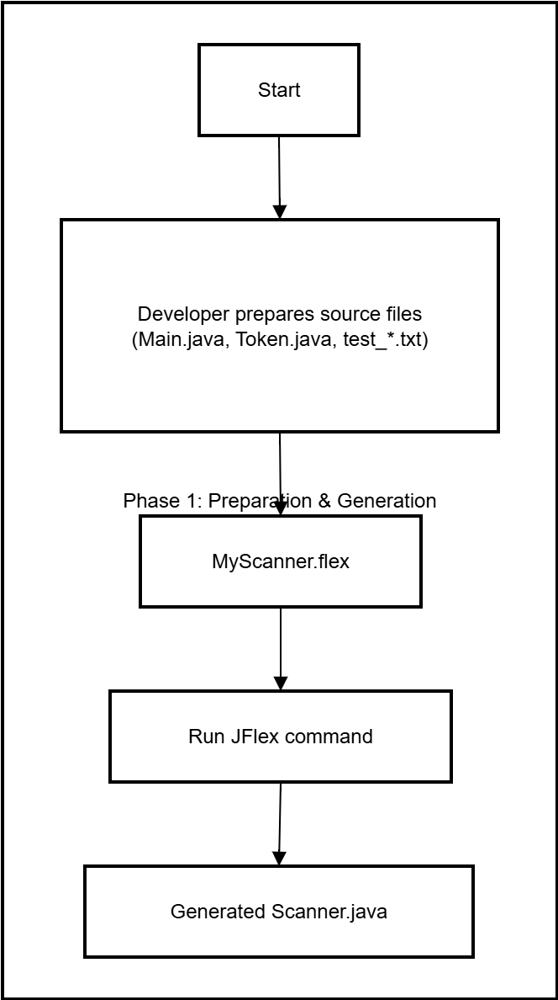
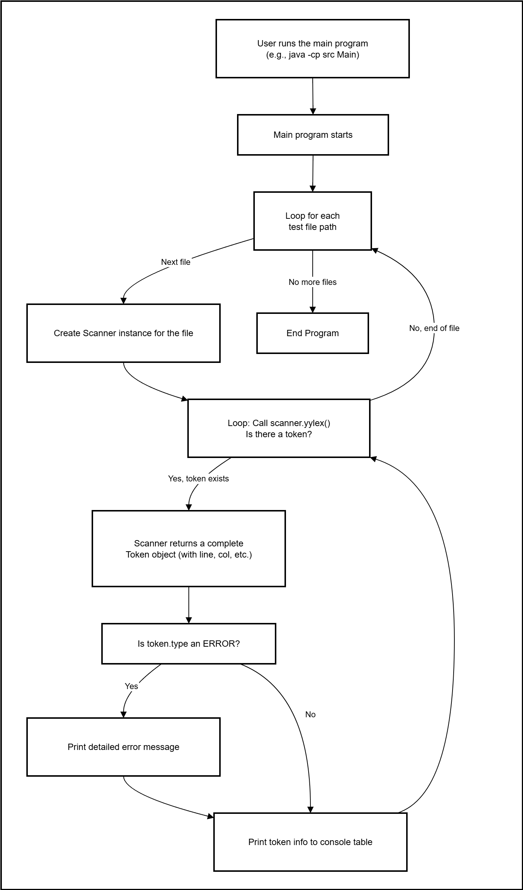
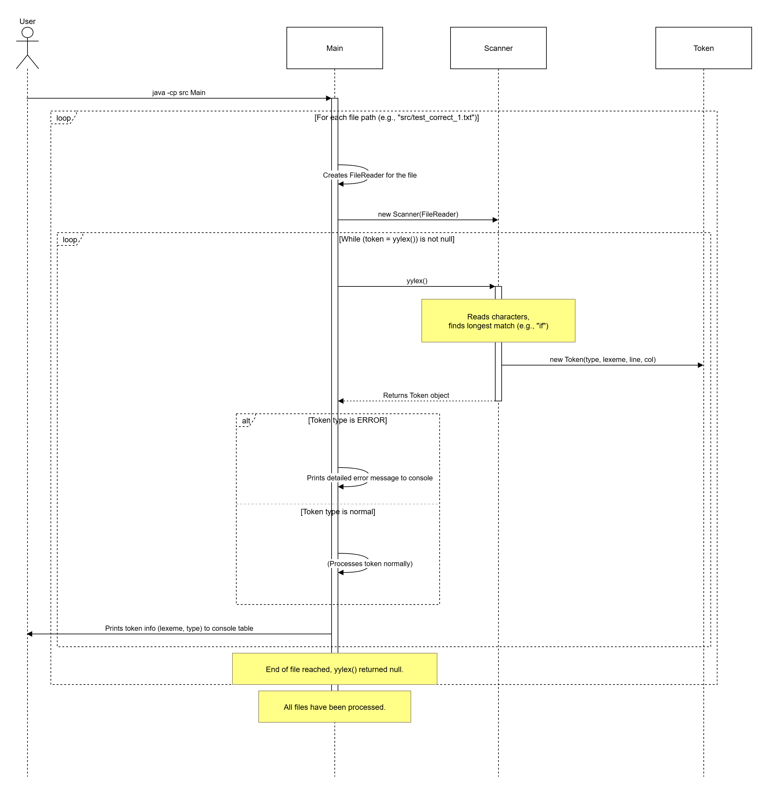

# JFlex 词法分析器示例

这是一个使用 [JFlex](https://jflex.de/) 构建的简单的词法分析器（Scanner），用于识别一个小型、特定的 Java 语言子集。该项目的主要目的是演示如何定义词法规则、生成扫描器以及如何处理正确的 Token 和词法错误。

## 功能特性

*   **Token 化**：能够识别关键字 (`if`, `for`, `int`等)、标识符、整数字面量、字符串、操作符和分隔符。
*   **错误处理**：能够检测并报告在词法规则中未定义的非法字符，并指出其所在的行号和列号。
*   **批量处理**：程序会自动分析 `src` 目录下的多个预设测试文件。
*   **清晰的输出**：为每个 Token 生成一个包含词素、Token 类型等信息的格式化表格。

## 项目结构

下面是项目关键文件和目录的说明：

```
felx-java/
│
├── src/                      # 所有源代码和测试文件
│   ├── Main.java             # 程序主入口，负责读取文件和驱动扫描器
│   ├── MyScanner.flex        # 核心！JFlex的词法规范文件
│   ├── Scanner.java          # <-- 由JFlex根据.flex文件自动生成，请勿手动修改！
│   ├── Token.java            # 用于封装Token信息的数据类
│   ├── TokenType.java        # 定义所有Token类型的枚举
│   ├── test_correct_1.txt    # 正确语法的测试用例1
│   ├── test_correct_2.txt    # 正确语法的测试用例2
│   ├── test_error_1.txt      # 包含词法错误的测试用例1
│   └── test_error_2.txt      # 包含词法错误的测试用例2
│
├── jflex.jar                 # JFlex库文件，用于生成Scanner
├── felx-java.iml             # IntelliJ IDEA 项目文件
└── README.md                 # 本说明文件
```

## 使用指南

### 环境要求

*   Java Development Kit (JDK) 11 或更高版本。

### 如何运行

您有两种方式来运行此项目，具体取决于您的目标。

---

#### 选项 A：直接运行已有的词法分析器

如果您只是想运行程序并查看分析结果，请按以下步骤操作。

1.  **打开终端** (命令行工具)。

2.  **进入项目根目录**，即 `felx-java` 文件夹。
    ```bash
    cd path/to/your/project/felx-java
    ```

3.  **编译所有 Java 源文件**。此命令会告诉编译器在 `src` 目录中寻找 `.java` 文件并进行编译。
    ```bash
    javac src/*.java
    ```
    编译成功后，`.class` 文件会出现在 `src` 目录中。

4.  **运行 Main 程序**。此命令会告诉 Java 虚拟机 (`java`) 从 `src` 目录加载类文件 (`-cp src`) 并执行 `Main` 类。
    ```bash
    java -cp src Main
    ```

之后，您将在控制台看到对所有 `test_*.txt` 文件的分析结果。

---

#### 选项 B：修改词法规则并重新生成分析器

如果您修改了 `MyScanner.flex` 文件（例如，添加了新的关键字或操作符），则需要重新生成 `Scanner.java`。

1.  **修改 `MyScanner.flex`** 文件以更新您的词法规则。

2.  **打开终端**并进入项目根目录 (`felx-java`)。

3.  **运行 JFlex 命令**来生成新的 `Scanner.java` 文件。
    ```bash
    java -jar jflex.jar src/MyScanner.flex
    ```
    > **注意**: 此命令会覆盖 `src/Scanner.java` 文件。

4.  **重新编译并运行**您的程序，步骤同 **选项 A** 的第 3 和第 4 步。
    ```bash
    # 重新编译
    javac src/*.java
    
    # 运行
    java -cp src Main
    ```

## 工作流程图

下面是项目从准备到执行的完整流程。





## 时序图

下图展示了程序运行时主要对象之间的交互。



---
*该 README 文件旨在为用户提供清晰的指导以便于使用和理解本项目。*